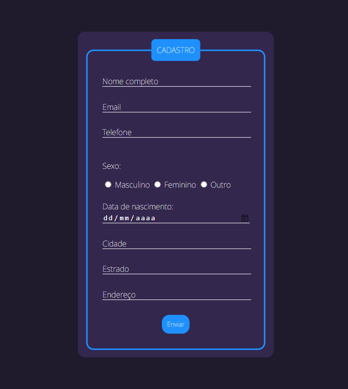

# Objetivo

O Desenvolvimento Web é uma área muito interessante e que me atrai. Por isso, desenvolvi este projeto simples de uma tela de cadastro de usuários. Um projeto trainee com o objetivo de teste de habilidades.

# Tecnologias Utilizadas

As tecnologias utilizadas neste projeto foram: `HTML` e `CSS`.

# Projetos Futuros

Como projetos e melhorias futuras:

- **Integração de JavaScript:** Há a possibilidade de integração de JavaScript no projeto, visando a melhora na interação do usuário com a página de cadastro.
- **Integração com Banco de Dados:** Há a possibilidade de integração com um banco de dados para armazenar os dados pegos pela página de cadastro.

👇 Veja a tela do projeto. 👇

 

